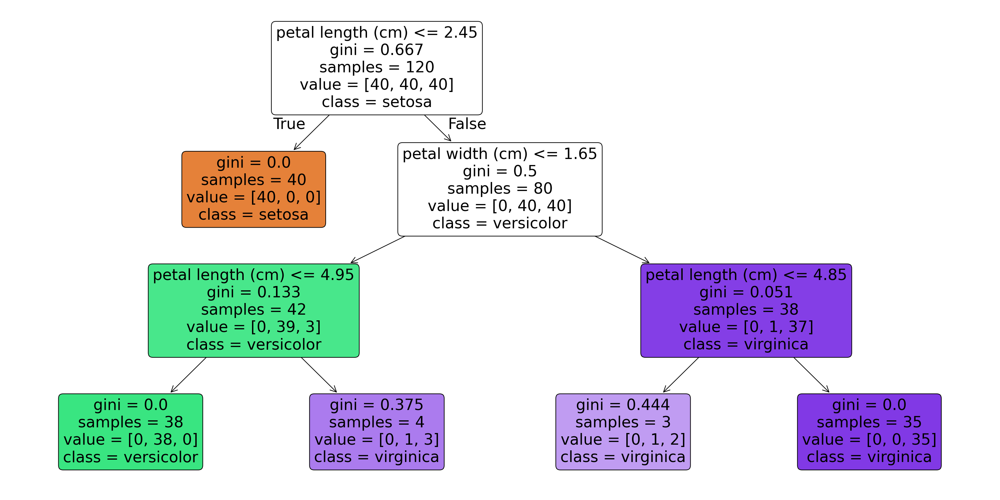

Decision trees remain one of the most intuitive yet powerful algorithms in our machine learning toolkit. Despite the rise of deep learning, their interpretability and effectiveness (especially as building blocks for ensemble methods) keep them relevant in production systems worldwide.

At its core, a decision tree recursively partitions the feature space $\mathcal{X} \subseteq \mathbb{R}^d$ into disjoint regions, assigning predictions to each terminal node, also known as a *leaf*. The model can be expressed as:

$$ f(\mathbf{x}) = \sum_{m=1}^{M} c_m \cdot \mathbb{1}(\mathbf{x} \in R_m) $$

where $R_1, R_2, \ldots, R_M$ represent the $M$ disjoint regions, $c_m$ is the prediction for region $R_m$, and $\mathbb{1}(\cdot)$ is the indicator function[^1].

## Building a Tree

The algorithm's effectiveness hinges on how we choose splits, as defined by a *splitting criteria*. For classification tasks, we typically rely on impurity measures.

The **Gini impurity** for a node $t$ with $K$ classes is defined as:

$$ G(t) = 1 - \sum_{k=1}^{K} p_k^2 $$

where $p_k$ represents the proportion of samples belonging to class $k$ at node $t$[^2]. A pure node (all samples from one class) yields $G(t) = 0$.

Alternatively, we can use **entropy**:

$$ H(t) = -\sum_{k=1}^{K} p_k \log_2(p_k) $$

The information gain from a split on feature $j$ at threshold $\tau$ is:

$$ \Delta H = H(t) - \frac{n_L}{n} H(t_L) - \frac{n_R}{n} H(t_R) $$

where $n_L$ and $n_R$ are the sample counts in the left and right child nodes respectively[^3].

### Regression: Variance Reduction

For regression trees, however, we minimize the mean squared error within each region:

$$ \text{MSE}(R_m) = \frac{1}{|R_m|} \sum_{\mathbf{x}_i \in R_m} (y_i - \bar{y}_m)^2 $$

where $\bar{y}_m$ is the mean target value in region $R_m$.

## Implementation with `scikit-learn`

The simplest way to understand how decision trees work is by walking through a practical implementation using a toy dataset like the iris species classification task:

```python
import numpy as np
from sklearn.datasets import load_iris
from sklearn.tree import DecisionTreeClassifier, export_text
from sklearn.model_selection import train_test_split
from sklearn.metrics import accuracy_score, classification_report

# Load and split data
X, y = load_iris(return_X_y=True)
X_train, X_test, y_train, y_test = train_test_split(
    X, y, test_size=0.2, random_state=42, stratify=y
)

# Train decision tree with controlled complexity
clf = DecisionTreeClassifier(
    criterion='gini',
    max_depth=4,
    min_samples_split=5,
    min_samples_leaf=2,
    random_state=42
)
clf.fit(X_train, y_train)
```

The `criterion` parameter accepts either `'gini'` or `'entropy`. In practice, they often yield similar trees[^4].

Understanding what your tree has learned is crucial, we can do so by visualizing the decision boundaries, that is, the labels assigned to the partitioned feature space:

```python
import matplotlib.pyplot as plt
from sklearn.tree import plot_tree

fig, ax = plt.subplots(figsize=(20, 10))
plot_tree(
    clf,
    feature_names=load_iris().feature_names,
    class_names=load_iris().target_names,
    filled=True,
    rounded=True,
    ax=ax,
    fontsize=22
)
plt.tight_layout()
```


We can also extract human-readable rules, if we prefer this format:

```python
tree_rules = export_text(clf, feature_names=load_iris().feature_names)
print(tree_rules)
```

```text
|--- petal length (cm) <= 2.45
|   |--- class: 0
|--- petal length (cm) >  2.45
|   |--- petal width (cm) <= 1.65
|   |   |--- petal length (cm) <= 4.95
|   |   |   |--- class: 1
|   |   |--- petal length (cm) >  4.95
|   |   |   |--- class: 2
|   |--- petal width (cm) >  1.65
|   |   |--- petal length (cm) <= 4.85
|   |   |   |--- class: 2
|   |   |--- petal length (cm) >  4.85
|   |   |   |--- class: 2
```

## The Overfitting Problem and Regularization

Decision trees are notoriously prone to overfitting. Without constraints, they will memorize the training data, achieving zero training error while generalizing poorly. The bias-variance tradeoff manifests clearly here[^5].

Fortunately, there are several key hyperparameters we can tune to regularize our decision trees:

1. `max_depth`: Limits the maximum depth of the tree, preventing excessively complex hierarchies
2. `min_samples_split`: Minimum samples required to split an internal node
3. `min_samples_leaf`: Minimum samples required at each leaf node
4. `max_features`: Number of features to consider when looking for the best split
5. `ccp_alpha`: Complexity parameter for Minimal Cost-Complexity Pruning

### Cost-Complexity Pruning

Post-pruning via cost-complexity pruning minimizes:

$$ R_\alpha(T) = R(T) + \alpha \cdot |T| $$

where $R(T)$ is the total misclassification cost, $|T|$ is the number of terminal nodes, and $\alpha \geq 0$ is the complexity parameter[^6].

```python
# Find optimal alpha using cross-validation
from sklearn.model_selection import cross_val_score

path = clf.cost_complexity_pruning_path(X_train, y_train)
ccp_alphas = path.ccp_alphas

cv_scores = []
for alpha in ccp_alphas:
    tree = DecisionTreeClassifier(ccp_alpha=alpha, random_state=42)
    scores = cross_val_score(tree, X_train, y_train, cv=5, scoring='accuracy')
    cv_scores.append(scores.mean())

optimal_alpha = ccp_alphas[np.argmax(cv_scores)]
print(f"Optimal ccp_alpha: {optimal_alpha:.6f}")
```

```text
Optimal ccp_alpha: 0.000000
```

## Feature Importance

Decision trees provide a natural measure of feature importance based on the total reduction in impurity:

$$ \text{Importance}(j) = \sum_{t: \text{split on } j} \frac{n_t}{n} \Delta G(t) $$

```python
importances = clf.feature_importances_
feature_names = load_iris().feature_names

for name, importance in sorted(
    zip(feature_names, importances), 
    key=lambda x: x[1], 
    reverse=True
):
    print(f"{name}: {importance:.4f}")
```

```text
petal length (cm): 0.5791
petal width (cm): 0.4209
sepal length (cm): 0.0000
sepal width (cm): 0.0000
```

Note that this measure has known biases, it tends to favor features with more unique values[^7]. For this reason, you may consider permutation importance as an alternative, although we will not be covering it in this post.

## Computational Complexity

The time complexity for building a decision tree is $O(n \cdot d \cdot \log n)$ for the average case, where $n$ is the number of samples and $d$ is the number of features. In the worst case (highly unbalanced trees), this degrades to $O(n^2 \cdot d)$[^8].

Prediction is remarkably efficient at $O(\log n)$ average case, making decision trees excellent for latency-sensitive applications.

## From Single Trees to Ensembles

The true power of decision trees emerges in ensemble methods:

1. **Random Forests**: Bootstrap aggregating (bagging) with random feature subsets reduces variance while maintaining low bias
2. **Gradient Boosted Trees**: Sequential fitting of shallow trees on residuals achieves state-of-the-art performance on tabular data
3. **XGBoost/LightGBM/CatBoost**: Optimized implementations with regularization and efficient handling of sparse data

```python
from sklearn.ensemble import RandomForestClassifier, GradientBoostingClassifier

# Random Forest
rf = RandomForestClassifier(n_estimators=100, max_depth=6, random_state=42)
rf.fit(X_train, y_train)
print(f"Random Forest Accuracy: {rf.score(X_test, y_test):.4f}")

# Gradient Boosting
gb = GradientBoostingClassifier(n_estimators=100, max_depth=3, random_state=42)
gb.fit(X_train, y_train)
print(f"Gradient Boosting Accuracy: {gb.score(X_test, y_test):.4f}")
```

```text
Random Forest Accuracy: 0.9000
Gradient Boosting Accuracy: 0.9667
```

## Personal Recommendations

After years of working with tree-based models, here are my key takeaways:

1. **Start simple**: Begin with a shallow tree (`max_depth=3` to `max_depth=5`) and increase complexity only if needed.
2. **Use cross-validation**: Always tune hyperparameters with proper validation to avoid data leakage.
3. **Consider ensembles for production**: Single trees rarely outperform ensembles on real-world problems.
4. **Leverage interpretability**: When stakeholders need explanations, decision trees offer unparalleled transparency. This is crucial for highly regulated environments (like financial services) where explainability can be expressed as a necessary constraint.
5. **Watch for class imbalance**: Use `class_weight='balanced'` or resampling techniques when dealing with skewed distributions.

## Conclusion

Decision trees exemplify the elegance of recursive partitioning. While they may not match deep learning on image or text data, they remain indispensable for tabular datasets, particularly when interpretability matters. Understanding their mechanics is foundational knowledge for any data scientist, especially given their role as base learners in gradient boosting frameworks that consistently dominate structured data competitions[^9].

[^1]: This formulation follows the CART (Classification and Regression Trees) framework introduced by [Breiman et al. (1984)](https://www.routledge.com/Classification-and-Regression-Trees/Breiman-Friedman-Stone-Olshen/p/book/9780412048418).

[^2]: Gini impurity reaches its maximum of $1 - 1/K$ when classes are uniformly distributed. For binary classification, the maximum is $0.5$.

[^3]: The logarithm base is arbitrary but conventionally set to 2, measuring information in bits. Using natural logarithm gives nats instead.

[^4]: Empirical studies by [Raileanu and Stoffel (2004)](https://link.springer.com/article/10.1023/B:AMAI.0000018580.96245.c6) found that the choice between Gini and entropy affects less than 2% of cases.

[^5]: An unpruned decision tree has high variance and low bias. The expected prediction error decomposes as $\mathbb{E}[(y - \hat{f}(\mathbf{x}))^2] = \text{Bias}^2 + \text{Variance} + \sigma^2$.

[^6]: This is also known as weakest-link pruning. The optimal $\alpha$ is typically selected via cross-validation.

[^7]: This is sometimes called "cardinality bias." [Strobl et al. (2007)](https://link.springer.com/article/10.1186/1471-2105-8-25) provide an excellent analysis of this phenomenon in Random Forests.

[^8]: Modern implementations use efficient algorithms like the "best-first" approach in scikit-learn, which maintains sorted feature values.

[^9]: As of 2026, gradient boosted trees (XGBoost, LightGBM, CatBoost) remain the dominant approach for tabular data in Kaggle competitions.